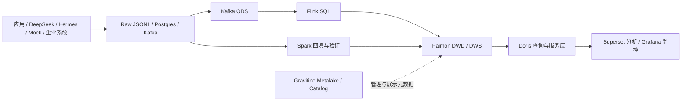

# AI Observability Lakehouse

面向 LLM 与 Agent 应用的流批一体可观测性湖仓。项目将请求、Agent 运行、检索、反馈、安全、评测、模型发布、合规、多 Agent 编排和平台健康事件，统一建模为可追溯的 DWD 明细、可复用的 DWS 指标与面向应用的 ADS 数据产品。

## 能解决什么问题

- 成本：模型、功能、团队和应用消耗了多少 token 与预算？
- 可靠性：哪些请求、Agent、工具或交接最容易失败或超时？
- 性能：端到端延迟发生在模型、检索、工具还是 Agent 编排？
- 质量：用户反馈、离线评测、Prompt 版本和检索质量如何变化？
- 治理：敏感资源访问、留存策略和 Guardrail 是否按规则执行？
- 平台：Kafka、Flink、Paimon、Doris 的健康指标是否越过阈值？

## 当前架构



核心组件：Python 3.11、Postgres 16、Kafka 3.9、Flink 1.20、Apache Paimon、Spark 3.5、Apache Gravitino 1.2、Doris 2.1、Superset 和 Grafana。Gravitino 通过 `ai_observability` metalake 管理和展示共享 Paimon catalog 元数据；Paimon 继续负责数据文件与快照存储，计算引擎仍使用 Paimon runtime 读写数据。完整职责与数据流见[项目架构](docs/architecture.md)。

## 实现范围

当前 Doris 数据产品清单包含 44 张表：

| 层 | 数量 | 覆盖范围 |
|---|---:|---|
| DWD | 12 | LLM、Agent、检索、反馈、安全、评测、发布、合规、编排 |
| DWS | 16 | 日/小时/会话、团队/区域/环境、质量、成本、健康指标 |
| DIM | 7 | 模型、模型版本、Prompt、团队、用户、知识库、规则 |
| ADS | 9 | 成本、SLA、质量、安全、满意度和管理周报 |

Postgres CDC 的默认自动入口当前只覆盖 LLM 请求。其他域已有事件模型、Kafka ODS/Flink、Spark、Paimon/Doris 和测试资产，但生产接入方需要向相应 Kafka topic 或批量入口发送事件。

## 快速开始

前置条件：Docker Compose、`uv`，建议至少 12 GB 可用内存。日常开发先启动轻量链路：

```bash
make infra-light
make seed-data
make flink-submit
scripts/check_pipeline_health.sh --skip-serving
```

需要查询层和仪表盘时再启动服务组件：

```bash
make infra-serving
make sync-doris
make infra-dashboard
make init-superset
make health
```

本地入口：Flink `http://localhost:8081`、Gravitino Web V2 `http://localhost:8090`、Doris FE `http://localhost:8030`、Superset `http://localhost:8088`、Grafana `http://localhost:3001`。Gravitino 状态和 catalog 可用 `make gravitino-status`、`make gravitino-catalogs` 检查。本地演示默认账号见[运行手册](docs/runtime_runbook.md)，不要复用于共享或生产环境。

运行测试：

```bash
uv run pytest -v
```

## 文档地图

| 文档 | 用途 |
|---|---|
| [产品文档](docs/product_document.md) | 用户、场景、能力范围、数据产品和非目标 |
| [项目架构](docs/architecture.md) | 组件边界、数据流、部署拓扑和关键设计决策 |
| [技术文档](docs/technical_document.md) | 模块、契约、处理语义、质量与扩展方式 |
| [数据模型](docs/data_model.md) | 分层、表清单、粒度、主关联和指标约束 |
| [指标定义](docs/metric_definitions.md) | 指标口径和查询方式 |
| [数据血缘](docs/data_lineage.md) | 域到表、作业和消费端的血缘 |
| [运行手册](docs/runtime_runbook.md) | 启停、检查、恢复和资源建议 |
| [Flink 作业说明](flink/README.md) | SQL 执行顺序与运行时说明 |
| [架构决策记录](docs/adr/) | Paimon、Kafka、DWS、DQ、仪表盘等决策 |
| [完整文档索引](docs/README.md) | 当前态、报告、ADR 与历史计划的分类 |

`docs/*_plan.md` 与迁移计划记录演进过程，不代表当前待实现范围；当前状态以本 README、架构/技术/产品文档、代码、DDL 和测试为准。

## 仓库结构

```text
app/        事件模型、数据契约、质量规则和共享逻辑
scripts/    采集、生成、Spark 作业、加载与运维脚本
flink/sql/  Flink Catalog、ODS、DWD、DWS 与验证 SQL
sql/        Postgres 源表、Doris DDL、同步与查询 SQL
config/     SLA、平台阈值、Superset/Grafana 资产
docs/       产品、架构、技术、模型、血缘、运行手册和 ADR
tests/      单元、契约、SQL 资产和可选 Paimon 集成测试
```

贡献或修改数据资产前，请先阅读 [AGENTS.md](AGENTS.md)。
