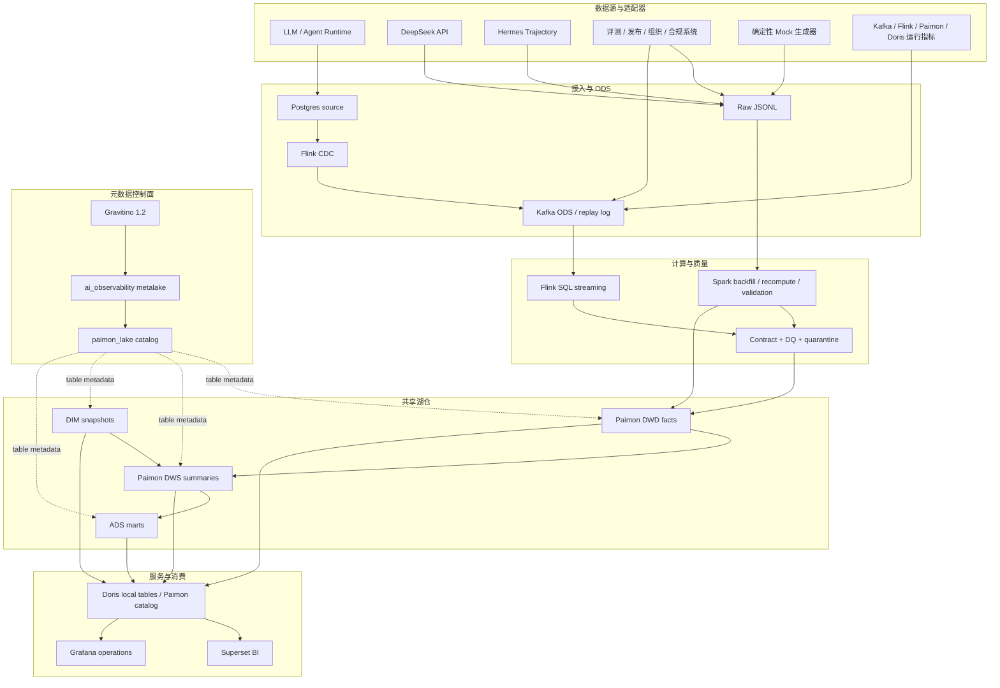
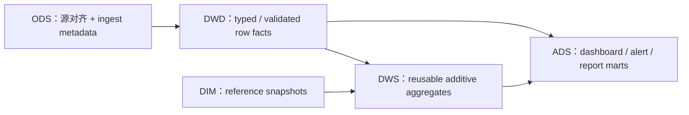

# 项目架构

> 状态：当前实现（2026-06-21）。历史方案和迁移过程见 `docs/*_plan.md` 与 `docs/adr/`。

## 1. 架构目标

本项目用一套可移植的数据模型统一观察 AI 应用的成本、性能、可靠性、质量、治理和平台状态。设计重点不是绑定某个 Agent 平台，而是通过 Gravitino 元数据控制面和共享数据契约，保证事件能在 Spark、Flink、Paimon、Doris 和本地 Parquet 之间保持相同语义。

## 2. 逻辑架构



## 3. 组件职责

| 平面 | 组件 | 职责 | 不负责 |
|---|---|---|---|
| Source | Python adapters / application hooks | 生成或规范化事件 | 仓库聚合 |
| Ingestion | Postgres CDC | 默认 LLM 业务源的变更捕获 | 所有扩展域的自动生产接入 |
| ODS | Kafka | 源对齐缓冲、解耦、回放 | 业务指标计算 |
| Streaming | Flink SQL | ODS→DWD 校验转换、部分 DWS 连续聚合 | 历史大范围重算 |
| Batch | Spark | 回填、离线转换、维度/ADS、结果验证 | 维持长运行 CDC 作业 |
| Metadata | Gravitino | 管理 `ai_observability` metalake、`paimon_lake` catalog，并提供 API/Web 元数据入口 | 保存 Paimon 数据文件、执行 Spark/Flink 查询 |
| Storage | Paimon | Flink/Spark 共享 DWD/DWS 表与一致快照 | 面向终端用户的 BI |
| Serving | Doris | 明细/聚合查询、Paimon Catalog、仪表盘数据源 | 流式采集 |
| Presentation | Superset | 业务分析、成本、合规、编排看板 | 平台时序监控 |
| Presentation | Grafana | 平台健康和运行状态 | 自助式业务分析 |

## 4. 两条执行路径

### 4.1 流式路径

```text
Postgres llm_request_events
  → Flink CDC
  → ods_ai_observability_llm_request_events_di (Kafka)
  → dwd_ai_llm_request_di (Paimon)
  → dws_ai_llm_feature_request_1h / 1d / session_1d (Paimon)
```

扩展域的 Kafka ODS、Flink DWD/DWS 定义已经存在。当前仓库没有为每个外部系统提供生产 connector；接入方应向对应 topic 写入契约兼容事件，或先走 Spark 批量入口。

### 4.2 批处理路径

```text
Raw JSONL / historical partitions / dimensions
  → Spark typed transform + DQ
  → Paimon DWD/DWS 或本地 Parquet 开发输出
  → DIM / ADS 计算
  → Doris load / query
```

Spark 与 Flink 不是两套仓库。两者使用 Paimon runtime 读写同一 warehouse，并遵守相同的 `paimon_lake` 命名和数据契约；Gravitino 将该 warehouse 注册到 `ai_observability` metalake，提供统一的元数据管理和查看入口。Flink 负责连续处理，Spark 负责历史和复杂离线计算。

## 5. 数据分层



- ODS 保留回放和追踪能力，不计算业务指标。
- DWD 是可审计的行级事实；敏感大文本原则上留在源/ODS，DWD 保存 hash/size。
- DWS 以稳定粒度保存计数、金额、延迟等可复用指标；比率尽量在查询层派生。
- ADS 允许面向 SLA、成本预算、满意度和周报做应用特定计算。
- DIM 使用 `df` 全量快照，为团队归属、Prompt/模型版本等提供上下文。

完整 44 表清单见[数据模型](data_model.md)。

## 6. 本地部署拓扑

| 分组 | Compose 服务 | 默认使用场景 |
|---|---|---|
| 轻量流式与元数据 | `postgres`, `kafka`, `gravitino`, `flink-jobmanager`, `flink-taskmanager` | 日常流式开发和 catalog 管理 |
| 查询服务 | `doris-fe`, `doris-be`, `doris-init` | DDL、同步和查询验证 |
| 仪表盘 | `superset-metadata`, `superset-redis`, `superset`, `grafana` | 演示和消费验证 |

Gravitino 使用独立 `gravitino_data` volume 持久化服务状态，并挂载共享 Paimon warehouse 以管理 catalog 元数据。Paimon warehouse 同时提供给 Flink，并以只读方式挂载给 Doris。详细命令与恢复流程见[运行手册](runtime_runbook.md)。

## 7. 关键设计决策

| 决策 | 结果 | 记录 |
|---|---|---|
| 共享湖仓格式 | Paimon，适配流式更新与 Spark 回填 | ADR 001、008 |
| 元数据控制面 | Gravitino 管理 metalake 与共享 Paimon catalog；存储仍由 Paimon 负责 | ADR 010 |
| 实时 ODS | Kafka，提供解耦和回放 | ADR 002 |
| 指标存储 | DWS 不冗余存放可派生 rate | ADR 003、006 |
| 流式 percentile | 明确使用 MAX 上界，不伪装为 p95 | ADR 004 |
| Agent 模型 | 通用 run/span/tool/handoff，不绑定 Dify | ADR 005 |
| 质量规则 | Spark/Flink 共享契约意图 | ADR 007 |
| 可视化 | Superset 做分析，Grafana 做运行监控 | ADR 009 |

## 8. 可靠性与安全边界

- Flink 本地环境启用 10 秒 checkpoint、EXACTLY_ONCE、保留外部 checkpoint、固定延迟重启和 savepoint 恢复。
- Gravitino 提供独立健康检查、幂等 metalake/catalog 初始化和 Web V2 管理入口；它不可替代数据质量、血缘采集或权限治理实现。
- 行级坏数据进入 quarantine；健康检查不替代表级验证 SQL 和契约测试。
- Demo 密码和本地网络暴露只适合开发机；生产需要独立密钥、TLS、RBAC、审计和外部持久化。
- 仓库实现的是参考架构与可运行本地环境，不包含生产级多节点高可用、云对象存储、统一身份、密钥管理或所有企业源 connector。
