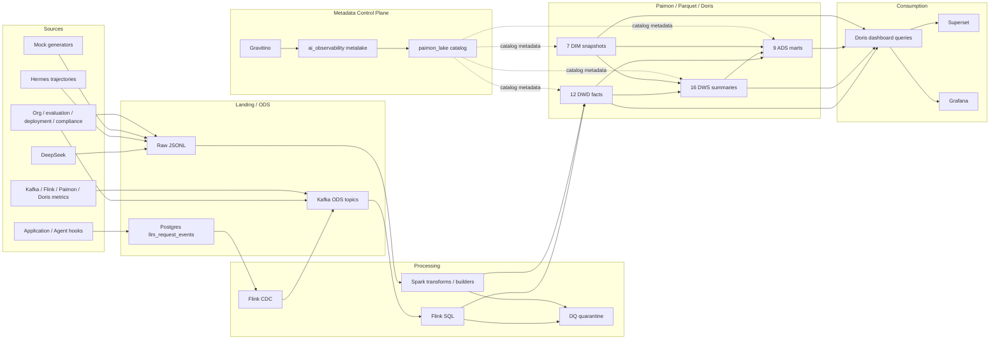

# 数据血缘

> 状态：当前实现（2026-06-21）。本页描述逻辑血缘；具体列级表达式以 Spark/Flink SQL 和 Doris query 为准。

## 1. 端到端血缘



## 2. 域级血缘

| 域 | Source/ODS | DWD | DWS | ADS/消费 |
|---|---|---|---|---|
| LLM | DeepSeek/mock/Postgres → LLM ODS | LLM request | feature 1h/1d、session、env、region | SLA、cost anomaly、overview |
| Agent | mock/Hermes/app hooks | run、span、tool call | agent、tool、agent team | reliability、tool、overview |
| Retrieval | app/mock → retrieval ODS | retrieval request | knowledge-base request | retrieval quality |
| Feedback | app/mock → feedback ODS | feedback action | feature action | satisfaction、session resolution |
| Guardrail | app/mock → guardrail ODS | guardrail check | rule check | guardrail violation |
| Evaluation | evaluator/mock → evaluation ODS | evaluation judgment | feature judgment | prompt version、executive summary |
| Model deployment | CI/CD/mock → deployment ODS | model deployment | — | model version DIM、release analysis |
| Cost governance | LLM/Agent facts + user/team DIM | — | cost team、agent team | budget、chargeback、weekly summary |
| Compliance | audit/retention producer | access audit、retention | — | compliance dashboard |
| Multi-agent | orchestrator/mock | orchestration handoff | handoff daily | orchestration dashboard |
| Platform | component collectors/mock | — | component health | Grafana、health dashboard |

## 3. 核心派生链路

```text
dwd_ai_llm_request_di
  ├─> dws_ai_llm_feature_request_1h
  │    └─> dws_ai_llm_feature_request_1d (Flink path)
  ├─> dws_ai_llm_session_request_1d <─ dwd_ai_feedback_action_di
  ├─> dws_ai_llm_feature_env_request_1d
  ├─> dws_ai_llm_region_request_1d
  ├─> dws_ai_cost_team_request_1d <─ dim_user_df / dim_team_df
  ├─> dws_ai_prompt_version_request_1d <─ evaluation DWS
  ├─> ads_observability_sla_feature_report
  └─> ads_observability_cost_feature_anomaly
```

```text
dwd_ai_agent_run_di + dwd_ai_agent_span_di
  ├─> dws_ai_agent_agent_run_1d
  ├─> dws_ai_agent_team_run_1d <─ dim_user_df
  └─> dws_ai_cost_team_request_1d

dwd_ai_agent_tool_call_di
  └─> dws_ai_agent_tool_tool_call_1d

dwd_ai_agent_orchestration_di
  └─> dws_ai_agent_orchestration_handoff_1d
```

## 4. 管理与仪表盘血缘

`ads_observability_executive_weekly_summary` 汇总 LLM、Agent、retrieval、feedback、guardrail、evaluation 和 cost 日指标，按 week × app 输出。周 rate 必须由周分子/分母计算，不平均每日 rate。

Superset 的三个当前 bundle 使用 Doris 表和 `sql/doris_dashboard_queries.sql`：AI overview、compliance & governance、agent orchestration。Grafana datasource 指向 Doris，主要消费 `dws_ai_platform_component_health_1d` 及相关运行查询。

## 5. 作业到目标表

| 作业/资产 | 主要输入 | 主要输出 |
|---|---|---|
| `10_ingest_ods_to_kafka.sql` | Postgres CDC LLM source | LLM Kafka ODS |
| `20_build_dwd_from_kafka_ods.sql` | Kafka ODS topics | 多域 Paimon DWD |
| `30_build_dws_from_dwd.sql` | Paimon DWD、platform ODS | 多域 Paimon DWS |
| `spark_transform_*.py` | Raw JSONL/Parquet | ODS/DWD/Quarantine |
| `spark_build_dws_*.py` | DWD + DIM | DWS |
| `spark_build_ads_*.py` | DWD/DWS/DIM + rules | ADS |
| `spark_build_dim_*.py` | 配置/事件/seed data | DIM snapshots |
| `load_dws_metrics_to_doris.py` | Parquet/Paimon-derived outputs | Doris local tables |
| `provision_superset_dashboards.py` | Doris datasets/query specs | Superset DB/dataset/chart/dashboard |
| `init_gravitino.sh` | Gravitino API + Paimon warehouse | `ai_observability` metalake、`paimon_lake` catalog |

## 6. 质量与审计血缘

- Spark DWD 记录 input/output/quarantine row counts 到 `data/warehouse/pipeline_runs.jsonl`（适用作业）。
- invalid rows 保留 `_dq_errors`，用于定位 completeness/validity/consistency 失败。
- Flink `91_verify_dwd_count.sql`、`92_verify_dws_metrics.sql` 提供运行后表级验证。
- `dwd_ai_compliance_data_retention_di` 记录数据生命周期动作，但不会自动执行 retention；执行系统必须产出证据事件。

## 7. 已知血缘缺口

- 仓库当前没有集中式 column-level lineage catalog；本页和 SQL/代码共同构成可读血缘。
- Gravitino 当前负责 catalog/table 元数据管理，不等同于已具备自动列级血缘、数据质量或业务 owner 信息；这些元数据仍需后续采集和补齐。
- 除 LLM Postgres CDC 外，扩展域的生产 producer/connector 不在仓库中统一交付。
- 异步 feedback/evaluation 和组织维度快照的 point-in-time join 需要部署方定义重算策略。
- Superset/Grafana 展示依赖 Doris 同步新鲜度；Doris local table 与 Paimon 直查的选择会影响最终数据延迟。
