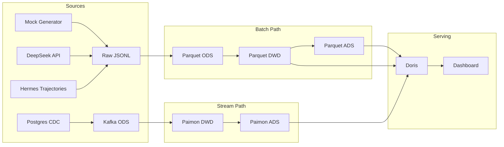

# Data Lineage

```mermaid
graph LR
    subgraph Sources
        A["Mock Generator"] --> R["Raw JSONL"]
        B["DeepSeek API"] --> R
        C["Hermes Trajectories"] --> R
        D["Postgres CDC"] --> K["Kafka ODS"]
    end
    subgraph Batch Path
        R --> ODS_B["Parquet ODS"]
        ODS_B --> DWD_B["Parquet DWD"]
        DWD_B --> ADS_B["Parquet ADS"]
    end
    subgraph Stream Path
        K --> DWD_S["Paimon DWD"]
        DWD_S --> ADS_S["Paimon ADS"]
    end
    subgraph Serving
        ADS_B --> CH["Doris"]
        ADS_S --> CH
        DWD_B --> CH
        CH --> DASH["Dashboard"]
    end
```
