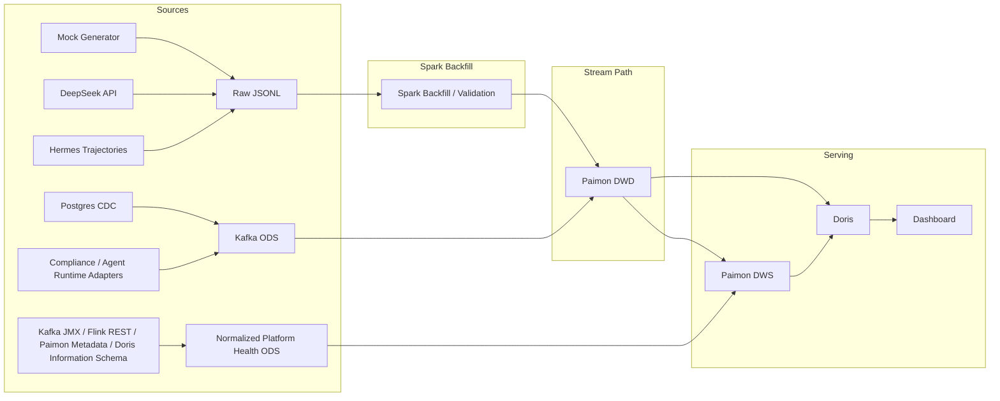

# Data Lineage

```mermaid
graph LR
    subgraph Sources
        A["Mock Generator"] --> R["Raw JSONL"]
        B["DeepSeek API"] --> R
        C["Hermes Trajectories"] --> R
        D["Postgres CDC"] --> K["Kafka ODS"]
        E["Compliance / Agent Runtime Adapters"] --> K
        F["Kafka JMX / Flink REST / Paimon Metadata / Doris Information Schema"] --> PH["Normalized Platform Health ODS"]
    end
    subgraph Spark Backfill
        R --> SP["Spark Backfill / Validation"]
    end
    subgraph Stream Path
        K --> DWD_S["Paimon DWD"]
    end
    SP --> DWD_S
    DWD_S --> DWS_S["Paimon DWS"]
    PH --> DWS_S
    subgraph Serving
        DWS_S --> CH["Doris"]
        DWD_S --> CH
        CH --> DASH["Dashboard"]
    end
```
