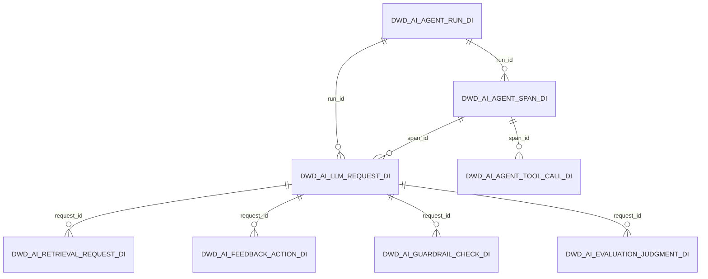

# 数据模型

> 状态：当前实现（2026-06-21）。字段与粒度事实来源依次为 `app/warehouse_contract.py`、Flink/Paimon SQL、Doris DDL 和 Spark 作业。

## 1. 模型原则

- 使用通用 AI observability 语义，不绑定 Dify、LangChain 或单一 Agent runtime。
- 事实表一行代表一个不可再分的业务事件；聚合表名称和主键直接表达 grain 与 period。
- ODS 保留源语义，DWD 负责类型与质量，DWS 负责复用聚合，ADS 负责具体消费，DIM 提供参考上下文。
- ID 是字符串；事件明细按 `date` 分区；日快照维度使用 `df`；日聚合使用 `1d`。
- 原始 prompt/response 等敏感大文本留在受控源/ODS，DWD 优先保存 hash、size 和统计字段。

## 2. 分层与物理实现

| 层 | 主要实现 | 语义 |
|---|---|---|
| Source/Raw | 应用事件、DeepSeek、Hermes、mock、JSONL、Postgres | 未进入仓库前的源数据 |
| ODS | Kafka topics、本地 Parquet landing | 源对齐事件 + 技术元数据，无业务聚合 |
| Metadata | Gravitino `ai_observability.paimon_lake` | 统一管理 Paimon namespace、table 和 catalog 元数据 |
| DWD | Paimon、Doris、本地 Parquet | typed、validated 行级事实 |
| DWS | Paimon、Doris、本地 Parquet | 可复用的小时/日/会话指标 |
| DIM | Doris/Paimon/Parquet snapshot | 模型、组织、Prompt、知识库和规则上下文 |
| ADS | Doris/Parquet | SLA、预算、质量、异常、trace 健康和管理报告 |

Gravitino 不新增仓库业务层，也不改变 46 张物理表的命名与粒度。它管理 `paimon_lake` 的元数据入口；Paimon 仍保存表数据、快照和文件。

## 3. ODS 事件入口

| ODS 表/topic | 源事件 |
|---|---|
| `ods_ai_observability_llm_request_events_di` | LLM request |
| `ods_ai_observability_agent_run_events_di` | Agent run |
| `ods_ai_observability_agent_span_events_di` | Agent span |
| `ods_ai_observability_agent_tool_call_events_di` | Tool call |
| `ods_ai_observability_retrieval_events_di` | Retrieval request |
| `ods_ai_observability_feedback_events_di` | Feedback action |
| `ods_ai_observability_guardrail_events_di` | Guardrail check |
| `ods_ai_observability_evaluation_events_di` | Evaluation judgment |
| `ods_ai_observability_model_deployment_events_di` | Model deployment action |
| `ods_ai_observability_compliance_access_audit_events_di` | Access audit event |
| `ods_ai_observability_compliance_data_retention_events_di` | Retention enforcement event |
| `ods_ai_observability_agent_orchestration_events_di` | Inter-agent handoff |
| `ods_ai_observability_platform_health_metrics_di` | Platform health observation |

默认 Postgres CDC 只自动生产第一个 LLM topic；其他 topic 需要应用 producer、采集器或显式加载流程。

Langfuse Score Event 是外部观测源的通用质量/反馈信号，不新增独立 ODS/DWD 事实表。采集适配器必须先按 `source`、`name` 和 `config` 分类：user/manual feedback 进入 Feedback Action 事件入口；evaluator/judge/test/dataset-run/automated score 进入 Evaluation Judgment 事件入口；目标缺失、分值越界、分类不明或分类冲突进入 quarantine。

## 4. DWD 事实表（12）

| 表 | 粒度 | 主 ID/关联 |
|---|---|---|
| `dwd_ai_llm_request_di` | 每个 provider request attempt result 一行 | `request_id`; `trace_id`, `run_id`, `span_id` |
| `dwd_ai_agent_run_di` | 每个端到端 Agent task/run 一行 | `run_id`, `trace_id` |
| `dwd_ai_agent_span_di` | 每个 Agent runtime span 一行 | `span_id`; `run_id`, `parent_span_id` |
| `dwd_ai_agent_tool_call_di` | 每次具体 tool invocation 一行 | `tool_call_id`; `run_id`, `span_id` |
| `dwd_ai_retrieval_request_di` | 每次 retrieval request 一行 | `retrieval_id`; `request_id`, `run_id` |
| `dwd_ai_feedback_action_di` | 每次 feedback action 一行 | `feedback_id`; `request_id`, `run_id` |
| `dwd_ai_guardrail_check_di` | 每次 guardrail rule evaluation 一行 | `guardrail_check_id`; `request_id`, `run_id` |
| `dwd_ai_evaluation_judgment_di` | 每次 evaluation judgment 一行 | `evaluation_id`; `request_id`, `run_id` |
| `dwd_ai_model_deployment_di` | 每次 model deployment action 一行 | `deployment_id`, model/version |
| `dwd_ai_compliance_access_audit_di` | 每次访问尝试一行 | `audit_event_id`, `user_id` |
| `dwd_ai_compliance_data_retention_di` | 每次分区留存动作一行 | `retention_event_id`, table/partition |
| `dwd_ai_agent_orchestration_di` | 每次 inter-agent handoff 一行 | `orchestration_id`; parent/child run |

### 4.1 核心运行时关系

这些是逻辑关联，不是数据库外键。迟到事件、异步 evaluation/feedback 和跨系统 ID 映射必须由接入方处理。

## 5. DWS 汇总表（16）

| 表 | 粒度 |
|---|---|
| `dws_ai_llm_feature_request_1d` | 每日 app × feature × model |
| `dws_ai_llm_feature_request_1h` | 每小时 app × feature × model |
| `dws_ai_llm_session_request_1d` | 每日 app × feature 的 session 汇总 |
| `dws_ai_llm_feature_env_request_1d` | 每日 app × feature × model × environment |
| `dws_ai_llm_region_request_1d` | 每日 region × environment × app × model |
| `dws_ai_agent_agent_run_1d` | 每日 app × agent × task type |
| `dws_ai_agent_tool_tool_call_1d` | 每日 agent × tool × tool type |
| `dws_ai_agent_team_run_1d` | 每日 team × app × agent × task type |
| `dws_ai_agent_orchestration_handoff_1d` | 每日 parent agent × child agent × handoff type |
| `dws_ai_retrieval_knowledge_base_request_1d` | 每日 app × knowledge base × embedding model × strategy |
| `dws_ai_feedback_feature_action_1d` | 每日 app × feature × agent |
| `dws_ai_guardrail_rule_check_1d` | 每日 app × rule category × action |
| `dws_ai_cost_team_request_1d` | 每日 team × app × model |
| `dws_ai_evaluation_feature_judgment_1d` | 每日 app × feature × evaluation dimension × evaluated model |
| `dws_ai_prompt_version_request_1d` | 每日 prompt × version × model；请求、成本、token、时延、evaluation pass/fail 与 score 分子/分母 |
| `dws_ai_platform_component_health_1d` | 每日 component × metric |

DWS 原则上保存可直接聚合的 count、token、amount、duration、score 和 distinct count。成功率、错误率、满意度等 rate 默认由查询/ADS 使用分子和分母计算。

## 6. DIM 维度表（7）

| 表 | 粒度/用途 |
|---|---|
| `dim_model_df` | 每个模型定义快照；provider、能力、价格、deprecated 状态 |
| `dim_model_version_df` | 每个 model version 快照；部署状态和 current-prod 标志 |
| `dim_prompt_version_df` | 每个 prompt/version 快照；owner、状态、A/B group |
| `dim_team_df` | 每个团队快照；department、cost center、预算 |
| `dim_user_df` | 每个用户快照；team 归属和访问层级 |
| `dim_knowledge_base_df` | 每个知识库快照；类型、文档数和更新时间 |
| `dim_guardrail_rule_df` | 每个 guardrail rule 快照；类别、默认严重度和 owner |

## 7. ADS 应用表（11）

| 表 | 粒度/用途 |
|---|---|
| `ads_observability_cost_feature_anomaly` | feature 成本异常 |
| `ads_observability_sla_feature_report` | feature 日 SLA 结果 |
| `ads_observability_prompt_prompt_version_metrics` | Prompt 版本效果消费表；按 prompt/version/model 对比请求、成本、token、时延、evaluation 与 score 分子/分母 |
| `ads_observability_retrieval_daily_quality` | 检索命中、零结果和时延质量 |
| `ads_observability_feedback_daily_satisfaction` | 满意度与再生成风险 |
| `ads_observability_guardrail_daily_violation` | 规则触发、阻断和策略时延 |
| `ads_observability_cost_daily_budget` | 团队/app MTD、预测和预算 breach |
| `ads_observability_cost_monthly_chargeback` | 团队/cost center 月度分摊 |
| `ads_observability_executive_weekly_summary` | app 周度跨域管理摘要 |
| `ads_observability_trace_health_detail` | 每个异常 Trace Envelope 一行，展示高成本、慢、失败 trace 的瓶颈 child observation 摘要 |
| `ads_observability_evaluation_dataset_experiment_regression` | 每个 dataset × experiment × baseline/candidate variant-model-prompt pair × evaluation dimension 一行；保存比较分子/分母 |

## 8. 核心字段族

不同事实按适用性复用以下字段族：

| 字段族 | 典型字段 | 说明 |
|---|---|---|
| Identity | `request_id`, `run_id`, `span_id`, `trace_id` | 唯一标识和跨域关联 |
| Subject | `app_name`, `feature_name`, `agent_id`, `model_name` | 业务归属 |
| Context | `user_id`, `session_id`, `region`, `environment` | 用户和运行环境 |
| Timing | `created_at`, `start_time`, `end_time`, `date` | 事件时间与分区 |
| Outcome | `status`, `error_type`, `http_status`, `is_*` | 结果和标志 |
| Usage | `prompt_tokens`, `completion_tokens`, `total_tokens` | 模型使用量 |
| Cost | `estimated_cost_usd`, budget/chargeback amounts | 估算或财务金额 |
| Performance | `latency_ms`, `duration_ms`, `retry_count` | 性能和重试 |
| Privacy-safe payload | `*_hash`, `*_size`, `*_chars` | 避免传播原始正文 |

精确类型、nullable/default 和列顺序不要从本文复制；实现时使用共享 contract 和对应 DDL。

## 9. Prompt Version Comparison

`dws_ai_prompt_version_request_1d` 是 prompt version 分析的唯一复用 DWS，不为 Langfuse-derived prompt analytics 新建平行 prompt DWS。它从 `dwd_ai_llm_request_di` 聚合每日 prompt/version/model 请求事实，并通过 `request_id` 将 `dwd_ai_evaluation_judgment_di` 归因到同一 prompt key。

缺失的 `prompt_id`、`prompt_version` 或 `model_name` 统一落到 `unknown`。同一 `request_id` 在同一天出现多个 prompt/version/model key 时，不把 evaluation score 复制到多个 prompt；DWS 通过 `metadata_conflict_cnt_1d` 暴露冲突请求数量。

ADS `ads_observability_prompt_prompt_version_metrics` 直接消费该 DWS，保留 `request_count`、`success_count`、`error_count`、`evaluation_count`、`pass_count`、`fail_count`、`evaluation_score_numerator` 和 `evaluation_score_denominator`。成功率、错误率、pass rate 与平均 score 由查询或比较函数使用累计分子/分母派生，不平均每日 rate。

## 10. Trace Health ADS

`ads_observability_trace_health_detail` 直接从 `dwd_ai_llm_request_di`、`dwd_ai_agent_run_di`、`dwd_ai_agent_span_di`、`dwd_ai_agent_tool_call_di` 和 `dwd_ai_retrieval_request_di` 构建，不新增 trace/session DWS。它的粒度是每个异常 Trace Envelope 一行：当 trace 高成本、慢、失败、有失败/慢 child observation，或 Agent Run 声明的 LLM/tool/retrieval child facts 缺失时输出诊断行。

该 ADS 保留 `trace_id`、`run_id`、`span_id`、`request_id`、`tool_call_id`、`retrieval_id` 等关联 ID，并用 `bottleneck_node_type` 标识瓶颈位置：`llm_generation`、`agent_span`、`tool_call`、`retrieval` 或 `orchestration`。输出只包含哈希、大小、metadata、状态、耗时、token 和成本等字段；不包含 prompt/response 明文、tool arguments 或 tool result 明文。

trace health 先在 ADS 落地，是因为 Langfuse trace 仍是 Trace Envelope，不稳定等同于 Agent Run 或 Session。当前价值是面向排障的下钻明细，而不是多个数据产品复用的稳定聚合 grain。只有当 trace/session 粒度被多个 ADS 反复复用，并且接入方对 run/session/trace 的边界约定稳定后，才考虑新增 DWS。

## 11. Evaluation Dataset/Experiment Regression ADS

`ads_observability_evaluation_dataset_experiment_regression` 直接连接现有 `dwd_ai_evaluation_judgment_di` 与 `dwd_ai_llm_request_di`，不新增 dataset/experiment DWD、DWS 或 DIM。Evaluation Judgment 提供 dimension、score、pass/fail、evaluated model 和 prompt version；LLM Request 通过 `request_id` 提供请求时延与估算成本。

dataset/experiment 归属来自受控 assignment 输入：`request_id`、`dataset_name`、`experiment_name`、`variant_name`。baseline/candidate 配对来自独立 comparison config：`dataset_name`、`experiment_name`、`baseline_variant`、`candidate_variant`。缺失字段、baseline 与 candidate 相同、或同一 request 在同一 dataset/experiment 下出现冲突 variant 的 metadata 不参与比较，避免把不确定归属固化到事实层。

物理 ADS 保存 baseline/candidate 两侧的 evaluation/pass/fail count、score numerator/denominator、latency numerator/denominator 和 estimated-cost numerator/denominator。pass rate、平均 score、平均 latency、平均 estimated cost、delta 和 quality/cost/latency regression flag 由累计分子分母派生；分母为 0 时返回 NULL。Prompt version 仅作为本 ADS 的比较维度，本实现不新增 Prompt version comparison ADS。

当前能力保持 ADS-level：dataset、experiment、variant、baseline 和 candidate 没有独立生命周期、权限、版本或维度快照。只有在需要稳定 dataset item/run/experiment ID、独立 CRUD 与状态机、跨多个 ADS/作业复用、版本化与可复现实验、owner/RBAC，或独立 retention/lineage 时，才应通过 ADR 升级为正式 dataset/experiment DWD/DWS/DIM 域模型。

## 12. 时间、迟到与快照

- DWD 使用事件对应的 `date` 分区，而不是处理机器当天日期。
- Flink 聚合按 event time 和 watermark 工作；当前小时窗口使用 5 秒 watermark，真实环境应按迟到分布调整。
- 异步 feedback/evaluation 可能晚于 request 到达；session 与 Prompt 质量重算要允许回填。
- DIM 是日全量语义。历史事实重算必须固定所需快照语义，避免用当前组织/价格覆盖历史口径。

## 13. 指标约束

- `request_count = success_count + error_count` 仅在状态全集严格为 success/error 时成立。
- rate 使用安全除法：分母为 0 时返回 NULL 或明确约定值，不默认返回 0。
- 成本注明估算/实际、币种、价格版本和排除项。
- percentile 注明算法与计算层；不得把 Flink 的 `MAX` 上界标为 p95。
- 周/月汇总必须由可加和分子分母加权，不能平均日 rate。

详细公式见[指标定义](metric_definitions.md)。

## 14. 生命周期

- ODS/DWD 支持追踪与回放，应比可重建的 DWS/ADS 保留更久。
- Doris 当前动态月分区配置保留至少过去 12 个月并创建未来 3 个月。
- Kafka 本地 retention 为 48 小时，仅用于开发；生产回放窗口应与恢复目标一致。
- 删除、匿名化和归档应产生 `dwd_ai_compliance_data_retention_di` 证据事件。
