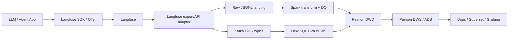

# Langfuse 采集层集成可行性调研

> 状态：调研结论（2026-06-26）。本文评估将 [Langfuse](https://github.com/langfuse/langfuse) 作为外部观测源接入本仓库采集层的可行性，不表示该 connector 已实现。

正式架构决策见 [ADR 011: Treat Langfuse as an External Observability Source](adr/011-langfuse-external-observability-source.md)。

## 1. 结论

可行，推荐以“Langfuse 作为外部标准化观测源，湖仓继续作为统一分析与治理底座”的方式接入。

现实动因是：许多 AI Agent 和 AI Application 已经使用 Langfuse 做 observability。对本仓库而言，支持 Langfuse 接入不是新增一个孤立数据源，而是降低现有 AI 应用接入湖仓的迁移成本，让这些应用可以继续使用 Langfuse 的调试、trace 查看和 prompt/evaluation 工作流，同时把统一指标、长期留存、跨域治理和 BI 服务交给本仓库。

优先路径是先做批量或准实时导出适配，把 Langfuse traces、observations 和 scores 规范化为现有 Kafka ODS / Spark ODS 事件；再评估是否在应用侧增加双写或 OpenTelemetry collector 旁路。不要直接把 Langfuse ClickHouse 表作为本仓库的 DWD/DWS，也不要让 Langfuse 替代现有 Paimon、Doris、Gravitino 和指标契约。

推荐优先级：

| 方案 | 可行性 | 推荐度 | 说明 |
|---|---|---:|---|
| Langfuse API / batch export -> 适配器 -> Kafka ODS / Raw JSONL | 高 | 高 | 改造面小，保留当前仓库契约，适合 POC 和历史回补 |
| 应用侧 Langfuse SDK + 本仓库 producer 双写 | 高 | 中 | 实时性好，但应用侵入和一致性处理成本更高 |
| OpenTelemetry collector 旁路分发到 Langfuse 和本仓库 | 中 | 中 | 长期架构干净，但需要先定义 OTLP 到业务字段的映射 |
| 直接读 Langfuse ClickHouse 内表 | 中 | 低 | 初期快，但强耦合 Langfuse 内部 schema 和版本演进 |
| 让 Langfuse 替代本仓库采集与湖仓 | 低 | 不推荐 | 会丢失跨域 DWD/DWS/ADS、Doris 服务层和统一指标口径 |

## 2. 外部依据

Langfuse 是开源 LLM engineering 平台，核心能力覆盖 tracing、monitoring、evaluation、debugging、prompt management、datasets 和 API。官方 README 明确支持 Python、JS/TS SDK、OpenAI、LangChain、LlamaIndex、LiteLLM、Vercel AI SDK、Mastra、Dify、OpenWebUI、CrewAI 等集成，并说明自托管版本使用 ClickHouse。

Langfuse 当前自托管 `docker-compose.yml` 依赖 `langfuse-web`、`langfuse-worker`、Postgres、ClickHouse、Redis 和 MinIO/S3，并包含事件上传 bucket、media upload bucket、batch export bucket、ingestion queue delay、ClickHouse write interval 等配置项。这说明 Langfuse 内部已经把高吞吐事件写入、异步处理和对象存储导出作为核心部署能力。

Langfuse 官方文档提供 OpenTelemetry / OTLP 接入能力，部署时通常配置到 `/api/public/otel` 相关 ingestion 路径。这对采集层有两层价值：应用可以用标准 tracing 语义进入 Langfuse；本仓库未来也可以在 collector 层复用同一份 span 数据，而不是只绑定 Langfuse SDK。POC 阶段应以目标 Langfuse 版本的文档或健康探测确认完整 OTLP endpoint。

Langfuse public API 已提供 trace、observation 和 score 查询入口。GitHub 当前主分支中存在：

- `web/src/pages/api/public/traces/index.ts`
- `web/src/pages/api/public/v2/observations/index.ts`
- `web/src/pages/api/public/v2/scores/index.ts`

其中 observations v2 API 通过 cursor、traceId、userId、level、name、type、environment、parentObservationId、startTime、version 等过滤条件读取 events table。scores API 支持 traceId、observationId、sessionId、userId、environment、source、timestamp 等过滤条件。trace API 支持按 user、session、environment、tags、timestamp 和字段组查询。它们足以支撑按时间窗口拉取增量数据的采集器 POC。

## 3. 与本仓库采集层的契合点

本仓库当前实时默认入口只覆盖 `llm_request_events` 的 Postgres CDC。扩展域已经有 Kafka ODS、Flink DWD/DWS、Spark、Paimon/Doris 和测试资产，但缺少统一生产 connector。

Langfuse 能补齐的是 LLM / Agent 应用运行时事件源。映射时先把 Langfuse trace 视为外部 trace envelope；它提供 `trace_id` 关联边界，但不自动等于本仓库的 `Agent Run`。只有当 Langfuse trace metadata 明确包含 run/task 语义，或接入方约定“一条 trace 就是一个端到端 Agent task”时，才映射为 `dwd_ai_agent_run_di`。

| Langfuse 概念 | 本仓库目标表 | 粒度判断 |
|---|---|---|
| Trace | 默认作为 `trace_id` 关联边界；满足 task/run 约定时映射到 `dwd_ai_agent_run_di` | 外部 trace envelope，不默认等于 Agent Run |
| Observation: span / chain | `dwd_ai_agent_span_di` | 每个 runtime span 一行 |
| Observation: generation | `dwd_ai_llm_request_di` | 每个 LLM provider request attempt result 一行 |
| Observation: tool / chain / retriever | `dwd_ai_agent_tool_call_di` 或 `dwd_ai_retrieval_request_di` | 按 observation type 和 metadata 映射 |
| Score / user feedback / evaluator result | `dwd_ai_feedback_action_di` 或 `dwd_ai_evaluation_judgment_di` | 按 score source、name、config 和绑定对象映射 |
| Prompt metadata / version | `dim_prompt_version_df`，并回填 LLM request 字段 | 维度快照或请求级冗余字段 |

现有字段契约已经有 `trace_id`、`run_id`、`span_id`、`request_id`、`session_id`、`user_id`、`model_name`、`provider`、`prompt_tokens`、`completion_tokens`、`total_tokens`、`latency_ms`、`status`、`environment` 和 `created_at`。Langfuse 的 trace/observation 结构与这些字段基本可映射。

## 4. 推荐目标架构

适配器职责：

- 从 Langfuse API 或 batch export 拉取 traces、observations、scores。
- 按现有表粒度拆分为 LLM request、Agent run、Agent span、tool call、retrieval、feedback 和 evaluation 事件。
- 对 prompt/response 正文执行 hash 和 size 提取，默认不把明文写入 DWD。
- 补齐本仓库必需字段：`app_name`、`feature_name`、`prompt_category`、`prompt_id`、`prompt_version`、`mode`、`region`、`environment`、`date`。
- 维护水位：按 `created_at` / `startTime` / cursor 增量拉取，记录 checkpoint，保证可重跑和幂等。
- 对无法映射或缺关键字段的行写入 quarantine，而不是中止整批。

## 5. DWS/ADS 参考方向

Langfuse 不只适合作为采集源，也值得作为 DWS/ADS 分析产品的参考对象。参考重点不是复制 Langfuse UI 或内部 ClickHouse schema，而是吸收它围绕 trace、session、observation、score、prompt version、dataset 和 experiment 建立的分析视角。

落地原则：

- DWS 层只沉淀可复用、可加和或稳定聚合的指标；成功率、错误率、通过率等 rate 仍优先在查询或 ADS 层用分子/分母派生。
- ADS 层面向具体使用场景组织数据产品，例如 prompt 版本对比、Agent trace 健康、evaluation 回归、release 前后对比和人工标注运营。
- Prompt/response 明文、Playground 交互状态、Langfuse 内部 trace UI 嵌套展示逻辑不进入 DWS/ADS。

### 5.1 DWS 可参考的聚合主题

| Langfuse 能力 | 建议 DWS 主题 | 可复用指标 |
|---|---|---|
| Trace / Session | Agent 或 LLM 会话与链路聚合 | `trace_cnt_1d`、`session_cnt_1d`、`observation_cnt_1d`、`span_cnt_1d`、`error_cnt_1d`、`total_dur_ms` |
| Observation | runtime span / generation / tool / retrieval 聚合 | `llm_call_cnt_1d`、`tool_call_cnt_1d`、`retrieval_cnt_1d`、`avg_latency_ms`、`max_latency_ms`、`input_chars`、`output_chars` |
| Cost / Usage | feature、model、prompt、team 维度成本聚合 | `prompt_tokens`、`completion_tokens`、`total_tokens`、`estimated_cost_usd`、`request_cnt_1d` |
| Scores | quality score 聚合 | `score_cnt_1d`、`score_sum_1d`、`pass_cnt_1d`、`fail_cnt_1d`、`manual_score_cnt_1d`、`auto_score_cnt_1d` |
| Prompt versions | prompt 版本请求与质量聚合 | `request_cnt_1d`、`success_cnt_1d`、`error_cnt_1d`、`score_cnt_1d`、`score_sum_1d`、`estimated_cost_usd` |
| Datasets / Experiments | dataset run 或 experiment 结果聚合 | `case_cnt_1d`、`passed_case_cnt_1d`、`failed_case_cnt_1d`、`score_sum_1d`、`latency_ms`、`estimated_cost_usd` |

候选 DWS 扩展方向：

| 候选表 | 粒度 | 说明 |
|---|---|---|
| 扩展 `dws_ai_prompt_version_request_1d` | 每天每 prompt、version、model 一行 | 优先增强现有 prompt version DWS，纳入 Langfuse score/evaluation 结果；不新增重复的 prompt DWS |
| `dws_ai_agent_trace_session_1d` | 每天每 app、agent、task type 或 session segment 一行 | 参考 Langfuse session/trace 视角，补足跨 run 的会话级健康指标；是否落表取决于 POC 后 session 粒度是否稳定 |
| `dws_ai_evaluation_score_1d` | 每天每 app、feature、score name、source、model 一行 | 支撑人工评分、LLM-as-judge 和自动 evaluator 统一聚合 |
| `dws_ai_experiment_variant_result_1d` | 每天每 dataset、experiment、variant、model 一行 | 支撑 prompt/model/release candidate 对比；POC 阶段可先做 ADS，不急于落 DWS |

这些表名是方向性建议。真正新增表前必须先确认 `TABLE_GRAINS`、DDL、Spark/Flink 作业、Doris loader、测试和当前态文档，避免与现有 `dws_ai_prompt_version_request_1d`、`dws_ai_evaluation_feature_judgment_1d` 等资产重叠。

当前阶段建议：先增强现有 prompt/evaluation/session 资产，并用 ADS 证明 Langfuse 风格的产品价值；只有当指标口径稳定且被多个 ADS 复用时，再新增 DWS 表。这样既能展示产品能力，也能避免学生项目里出现过多同义表和不可维护的宽表。

### 5.2 ADS 可参考的数据产品

| Langfuse 能力 | 建议 ADS 数据产品 | 面向问题 |
|---|---|---|
| Trace drilldown | Agent trace 健康清单 | 哪些 trace/session 失败、慢、成本高，瓶颈在 LLM、tool、retrieval 还是 orchestration |
| Metrics | AI 应用运行概览 | 按 app/feature/model/environment 看 volume、cost、latency、error 和质量趋势 |
| Scores / Evaluation | Evaluation 回归报告 | 新 prompt、model 或 release 是否带来质量退化、成本升高或延迟恶化 |
| Prompt management | Prompt 版本效果对比 | 不同 prompt version 在成功、质量、token、成本、延迟上的差异 |
| Datasets / Experiments | Dataset / experiment 对比报告 | baseline 与 candidate 在固定样本集上的通过率、平均分、成本和延迟 |
| Annotation queue | 人工标注运营看板 | 待标注、已标注、争议样本、低分样本和问题类别如何变化 |

候选 ADS 扩展方向：

| 候选表 | 主题 | 说明 |
|---|---|---|
| `ads_observability_trace_health_detail` | Trace 诊断 | 面向下钻清单，可包含高成本、慢 trace、失败 span 摘要和关联 request/span id |
| `ads_observability_prompt_version_comparison` | Prompt 对比 | 面向 prompt 发布评审，聚合版本间质量、成本、延迟和错误分布 |
| `ads_observability_evaluation_regression` | Evaluation 回归 | 面向 release / experiment，比较 baseline 与 candidate |
| `ads_observability_annotation_workbench` | 标注运营 | 面向人工反馈和审核流程，保留任务状态与覆盖率类指标 |

当前阶段可以做 dataset/experiment 能力，但建议定位为 ADS 级产品能力，而不是马上扩出完整实验域模型。最小闭环是：使用现有 `dwd_ai_evaluation_judgment_di` 承载 evaluation 结果，把 dataset、experiment、variant、baseline/candidate 先作为受控 metadata 或配置输入进入 ADS 计算；当这些概念需要独立生命周期、权限或复用聚合时，再提升为 DWD/DWS/DIM 正式资产。

### 5.3 不建议照搬的能力

- Langfuse Playground 是交互式调试能力，不适合作为 DWS/ADS 表模型。
- Prompt 正文和 response 正文不应进入 DWD/DWS/ADS；DWS/ADS 使用 hash、size、prompt id、prompt version 和 score 即可。
- Langfuse 内部 ClickHouse schema 不应成为本仓库的事实模型来源；正式口径仍以 `app/warehouse_contract.py`、SQL DDL/DML 和当前态文档为准。
- Trace UI 的完整嵌套树适合在线调试，不适合直接落为 ADS 宽表；ADS 应保留关键路径、失败节点、慢节点和关联键。

## 6. 字段映射草案

### 6.1 Generation -> `dwd_ai_llm_request_di`

| 目标字段 | Langfuse 来源建议 | 注意事项 |
|---|---|---|
| `request_id` | observation id | 若同一次 provider retry 有多个 observation，应使用 attempt 级 id |
| `trace_id` | trace id | 保持跨表主关联 |
| `run_id` | trace id 或 trace metadata.run_id | 建议由应用显式写入 metadata，避免 trace 与 run 粒度混淆 |
| `span_id` | parent observation id 或 observation id | generation 若本身就是 span，可用 observation id |
| `user_id` | trace userId | 需要脱敏策略 |
| `session_id` | trace sessionId | 可直接映射 |
| `app_name` | project name 或 trace metadata.app_name | 推荐应用显式写 metadata |
| `feature_name` | trace name、tags 或 metadata.feature_name | 需要统一枚举 |
| `prompt_id` / `prompt_version` | prompt metadata / prompt name/version | 缺失时置空或 unknown，不从 prompt 文本推断 |
| `model_name` | observation model | 需要和 `dim_model_df` 对齐 |
| `provider` | model provider metadata | Langfuse 不一定总是规范化 provider |
| `prompt_hash` / `response_hash` | input/output 内容 hash | 不落明文到 DWD |
| `input_chars` / `output_chars` | input/output 序列化长度 | 多模态内容需另定规则 |
| `prompt_tokens` / `completion_tokens` / `total_tokens` | usage details | 注意不同 provider 字段名 |
| `latency_ms` | endTime - startTime | 缺 endTime 的事件进 quarantine 或延迟处理 |
| `status` / `error_type` | level、statusMessage、metadata.error | 需要把 Langfuse level 映射为 `success` / `error` |
| `estimated_cost_usd` | cost details 或本仓库价格表重算 | 推荐优先重算，避免跨系统成本口径漂移 |

### 6.2 Span / Tool / Score 映射

| 目标表 | 最小来源字段 | 关键约束 |
|---|---|---|
| `dwd_ai_agent_run_di` | trace id、trace name、userId、sessionId、timestamp、metadata | 必须明确 run 粒度，不能把整个 session 误当单个 run |
| `dwd_ai_agent_span_di` | observation id、parentObservationId、trace id、name、type、start/end | observation tree 可保留 parent-child |
| `dwd_ai_agent_tool_call_di` | observation type/name、input/output、duration、status | tool name/type 需要 metadata 约定 |
| `dwd_ai_retrieval_request_di` | retriever observation、query、top_k、scores、latency | Langfuse 原始字段可能不足，建议应用写 metadata |
| `dwd_ai_feedback_action_di` | score/user feedback、traceId、observationId、name、value | `source` 为 user/manual feedback，或 score name 被配置为反馈类时进入此表 |
| `dwd_ai_evaluation_judgment_di` | score/evaluator、value、comment、config、model | evaluator、judge、test、dataset run 或自动评价类 score 进入此表 |

## 7. 主要风险

| 风险 | 影响 | 缓解 |
|---|---|---|
| Langfuse 内部 ClickHouse schema 随版本变化 | 直接读库 connector 易碎 | 首选 public API / export；直接读库只用于临时 POC |
| Trace 与 Agent run 粒度不一致 | DWS agent 指标失真 | 要求应用写 `metadata.run_id`、`agent_id`、`task_type` |
| Prompt/response 明文泄露 | 违反仓库安全约束 | 适配器默认 hash/size；Raw landing 设置更短保留和访问控制 |
| Usage/cost 字段不同 provider 不统一 | 成本指标漂移 | token 进入 DWD，成本用本仓库 `model_pricing` 重算或标明来源 |
| Score 语义过宽 | feedback 与 evaluation 混淆 | 用 score source/name/config 建映射规则 |
| 增量拉取乱序或迟到 | 漏数/重复 | cursor + 时间回看窗口 + request_id 幂等 upsert |
| Langfuse 项目/环境与本仓库 app/feature 不一致 | 维度聚合不可比 | 先定义 metadata 命名约定和枚举表 |

## 8. POC 范围

建议先做最小 POC，不新增 DWD 表：

1. 部署 Langfuse 本地或连接测试项目，生成少量 OpenAI/LangChain/Langfuse SDK trace。
2. 编写 `scripts/export_langfuse_observations.py`，按时间窗口拉取 traces、observations、scores，输出 Raw JSONL。
3. 编写 `scripts/normalize_langfuse_events.py`，输出三类契约兼容 JSONL：LLM request、Agent span、score/evaluation。
4. 复用现有 Spark transform 写入本地 ODS/DWD Parquet，或写入 Kafka ODS topic 走 Flink。
5. 验证 `dwd_ai_llm_request_di`、`dwd_ai_agent_span_di`、`dwd_ai_evaluation_judgment_di` 行数、关联键和 DQ quarantine。
6. 补充测试：字段映射单测、缺字段 quarantine、重复事件幂等、明文不进入 DWD。

验收标准：

- 每条 generation 能映射为一行 `dwd_ai_llm_request_di`。
- trace/observation parent-child 能在 `trace_id`、`run_id`、`span_id` 上关联。
- DWD 不包含 prompt/response 明文，只包含 hash 和 size。
- token、latency、status、environment 通过现有 DQ 规则。
- 至少一条 score 能映射为 evaluation 或 feedback，并说明选择规则。

## 9. ADR 与后续决策

已新增 [ADR 011](adr/011-langfuse-external-observability-source.md)，明确 Langfuse 是外部 AI runtime observability source，不是本仓库的湖仓、服务层或事实模型来源。

后续从 POC 进入正式 connector 时，还需要在实现文档或追加 ADR 中明确：

- 正式 connector 使用 public API/export、OTel collector 还是应用双写。
- Raw 明文数据的保留、脱敏、权限和审计策略。
- Langfuse metadata 到本仓库 app/feature/agent/task/prompt 维度的治理规则。
- 哪些 Langfuse 分析视角进入 DWS/ADS，哪些仅保留为 Langfuse 在线调试能力。

## 10. 参考链接

- [Langfuse GitHub repository](https://github.com/langfuse/langfuse)
- [Langfuse tracing documentation](https://langfuse.com/docs/tracing)
- [Langfuse OpenTelemetry integration](https://langfuse.com/docs/opentelemetry/get-started)
- [Langfuse API documentation](https://langfuse.com/docs/api)
- [Langfuse self-hosting documentation](https://langfuse.com/self-hosting)
- [本仓库项目架构](architecture.md)
- [本仓库数据模型](data_model.md)
- [本仓库数据血缘](data_lineage.md)
