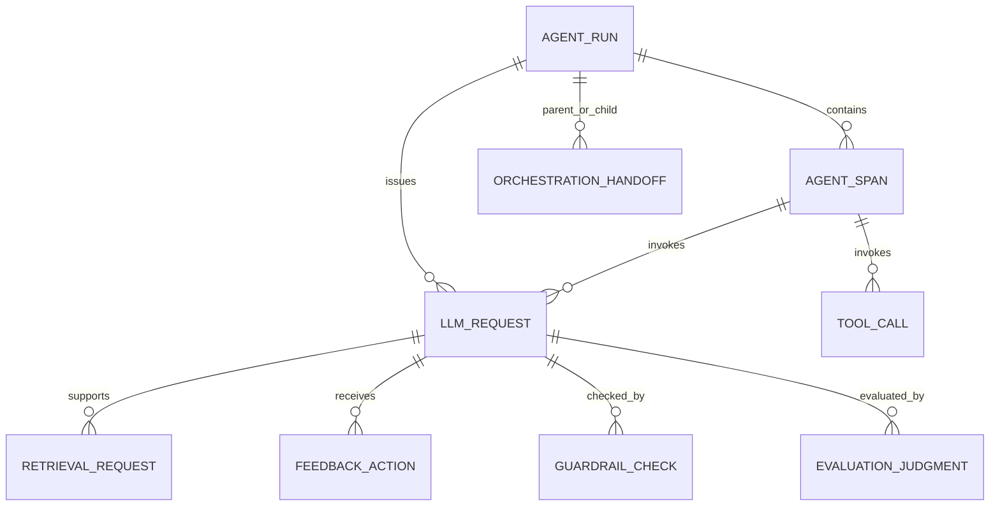

# AI Observability Lakehouse 技术文档

> 状态：当前实现（2026-06-21）。架构总览见[项目架构](architecture.md)，运行命令见[运行手册](runtime_runbook.md)。

## 1. 技术目标

- 用通用事件模型覆盖 LLM、Agent 和治理域，不绑定单一框架。
- 让 Gravitino 统一管理共享 Paimon catalog 元数据，并让 Spark、Flink、Doris 和本地 Parquet 使用一致的表名、字段语义和粒度。
- 允许实时增量、历史回填和离线重算写入同一逻辑仓库。
- 将坏数据隔离、可派生指标延后、敏感正文最小化。
- 通过可运行本地环境、确定性 fixtures 和契约测试验证设计。

## 2. 技术栈与版本

| 类别 | 组件 | 当前版本/约束 | 用途 |
|---|---|---|---|
| Runtime | Python | 3.11+ | 事件模型、作业和工具 |
| Batch | PySpark | `>=3.5,<4` | 回填、DWS/DIM/ADS、验证 |
| CDC/Streaming | Flink | 1.20 | Postgres CDC、Kafka、流式 DWD/DWS |
| ODS | Kafka | 3.9.0 | 事件缓冲与回放 |
| Lakehouse | Paimon | Flink 镜像内集成 | 共享 DWD/DWS 存储 |
| Metadata | Apache Gravitino | 1.2.0 | metalake、Paimon catalog 和表元数据管理 |
| Serving | Doris | 2.1.11 | OLAP 与 Paimon Catalog |
| Source | Postgres | 16 | 本地 LLM operational source |
| BI | Superset | Docker image build | 业务分析 |
| Monitoring | Grafana OSS | 11.6.0 | 平台监控 |
| Tests | pytest | 9+ | 单元、契约和资产测试 |

精确 Python 依赖以 `pyproject.toml` 为准，服务镜像以 `docker-compose.yml` 为准。

## 3. 代码模块

### 3.1 `app/`

- `*_event.py`：dataclass/解析逻辑和领域事件。
- `warehouse_contract.py`：核心字段契约、各表粒度、跨引擎列定义与验证规则。
- `data_quality.py`：Spark 行级校验和 valid/quarantine 分流。
- `model_pricing.py`：模型价格配置与估算逻辑。
- `pipeline_metadata.py`：有限作业的行数、耗时、状态和 quarantine 元数据。
- `deepseek_client.py`、`logging_utils.py`：源适配和通用日志能力。

新增字段时，优先扩展共享 `FieldContract`/表契约，再由 Spark projection、Flink SQL 测试和 Doris DDL 消费或对齐。

### 3.2 `scripts/`

脚本分为五类：

| 类型 | 命名示例 | 作用 |
|---|---|---|
| Source fixture/collector | `generate_mock_*`, `run_deepseek_live_calls.py` | 生成或采集原始事件 |
| DWD transform | `spark_transform_*` | 类型转换、校验、写入明细 |
| DWS builder | `spark_build_dws_*` | 可复用粒度聚合 |
| ADS/DIM builder | `spark_build_ads_*`, `spark_build_dim_*` | 应用数据产品和快照维度 |
| Runtime/loader | `run_*`, `check_*`, `load_*`, `flink_*`, `init_gravitino.sh` | 启动、元数据初始化、提交、恢复、加载和检查 |

### 3.3 `flink/sql/`

执行顺序：

```text
00_catalogs.sql
01_source_postgres_cdc.sql
02_ods_kafka_tables.sql
03_dwd_paimon_tables.sql
04_dws_paimon_tables.sql
10_ingest_ods_to_kafka.sql
20_build_dwd_from_kafka_ods.sql
30_build_dws_from_dwd.sql
```

`91_verify_dwd_count.sql` 与 `92_verify_dws_metrics.sql` 是表级验证，不属于持续写入 job。

当前 `10_ingest_ods_to_kafka.sql` 只将 Postgres `llm_request_events` 写入 LLM ODS topic。`20`/`30` 已定义多个扩展域消费链路，但这些 topic 需要外部 producer 或其他加载流程提供事件。

### 3.4 `sql/` 与 `config/`

- `source_postgres_schema.sql`：本地 CDC 源表。
- `create_doris_tables.sql`：46 表 Doris 物理模型和动态分区。
- `doris_create_paimon_catalog.sql`：Doris 对 Paimon warehouse 的只读查询入口。
- `doris_sync_paimon_dws.sql`、`load_dws_metrics_to_doris.py`：Paimon/Parquet 到 Doris local table 的同步路径。
- `doris_dashboard_queries.sql`：12 个可复用消费查询。
- `sla_rules.yaml`、`platform_health_thresholds.yaml`：可配置业务/平台阈值。
- `config/superset`、`config/grafana`：可复现仪表盘资产。
- Gravitino 服务配置、持久化和 Paimon warehouse 挂载由 Compose 管理；`scripts/init_gravitino.sh` 幂等创建 metalake 与 catalog。

## 4. 事件与关联模型

核心可观测性关联：



关联主要依赖 `trace_id`、`run_id`、`span_id`、`request_id`。仓库采用分析型弱约束，不在 Doris/Paimon 中声明跨表外键；完整性通过生产约定、DQ 和测试维护。

## 5. 数据处理语义

### 5.1 ODS

- 与源字段对齐，附加 `source_name`、`source_event_type`、`ingested_at`、`raw_event_json` 等技术信息（批路径按适用性）。
- 不计算成本、成功率或聚合指标。
- Kafka topic 同时承担实时缓冲和短期回放日志；本地 Kafka retention 为 48 小时。

### 5.2 DWD

- 一个业务事件一行，使用稳定字符串 ID 和明确事件时间。
- 将数值、日期和枚举转换为契约类型。
- LLM DWD 不保存原始 prompt/response 正文，保存 hash、字符数和 token。
- 校验失败进入 quarantine，并保留 `_dq_errors` 和分类信息供诊断。

### 5.3 DWS/ADS

- DWS 保存稳定粒度的计数、token、金额、延迟和 distinct 数等直接聚合。
- rate 默认由查询层使用计数派生，避免分母变化和二次聚合错误。
- Spark 使用 `percentile_approx` 计算 p95/p10。Flink 本地流式场景不支持目标 percentile 时，使用明确的 `max_*` 上界并将不可用 percentile 标识为不可用/占位，消费端不能误读。
- ADS 可以跨 DWS/DIM 计算 MTD、projection、breach、quality flag 等应用语义。

## 6. 一致性与数据质量

### 6.1 契约

`app/warehouse_contract.py` 至少维护：

- `TABLE_GRAINS`：12 DWD + 16 DWS 的业务粒度。
- 核心事实与汇总的 Spark/Flink/Doris 字段映射。
- LLM request 的共享验证规则。

`tests/test_warehouse_contract.py`、`tests/test_doris_schema.py`、`tests/test_flink_sql_assets.py` 用于检测字段、表和资产漂移。

### 6.2 质量规则

LLM 示例规则包括 ID/时间完整性、token 非负与总数一致、正延迟、合法状态/模式和非负成本。新增域应使用同样结构定义 completeness、validity、consistency 等错误类别。

### 6.3 对账

建议对同一时间分区比较：

```text
source_count
  = valid_dwd_count + quarantine_count (+ 明确的去重/过滤差异)

sum(DWS request_count)
  = 对应粒度范围内 DWD count
```

跨 Spark/Flink 验证必须固定相同事件时间窗口、迟到策略、维度快照和 percentile 算法。

## 7. 存储与服务

- Gravitino 是元数据控制面：metalake 为 `ai_observability`，relational catalog 为 `paimon_lake`，provider 为 `lakehouse-paimon`，filesystem warehouse 为 `file:///workspace/data/paimon`。
- Paimon 是共享 warehouse 和数据/快照存储，Flink 和 Spark 使用 Paimon runtime 写入相同逻辑表；Gravitino 为相同 `paimon_lake` 提供元数据管理入口。
- Doris 同时支持 local table 与 Paimon Catalog 查询；前者适合固定低延迟看板，后者减少复制并支持湖仓直接读取。
- Gravitino 当前管理共享 Paimon catalog；Doris serving catalog 仍按 Doris 自身 DDL/Catalog 资产管理，不能把两者混为同一注册链路。
- Doris 明细表使用 DUPLICATE KEY，按 `date` 动态月分区，当前默认保留过去 12 个月并预建未来 3 个月。
- `scripts/load_dws_metrics_to_doris.py` 对数据库/表标识符做白名单式校验，再执行加载。

## 8. 可视化资产

- Superset 的当前事实来源是 `scripts/provision_superset_dashboards.py --provision`；同一 spec 可输出 Superset 4.1 ZIP/YAML bundle。
- Grafana datasource 和 dashboard JSON 通过目录 provisioning 自动加载。
- 两者都通过 MySQL 协议连接 Doris `9030`；Superset 面向分析，Grafana 面向平台健康。

## 9. 测试策略

| 测试层 | 例子 | 目的 |
|---|---|---|
| Pure/unit | pricing、event parsing、identifier validation | 快速验证业务逻辑 |
| Spark transform | `test_*_events.py` | 类型、DQ、聚合和 join 粒度 |
| Contract/DDL | warehouse、Doris、Flink tests | 防止跨引擎 schema 漂移 |
| Asset | dashboard、SQL、Compose、Gravitino tests | 保证可运行资产完整 |
| Integration | `paimon` marker | 验证 Spark/Paimon round trip |

标准命令：

```bash
uv run pytest -v
```

只检查核心跨层契约：

```bash
uv run pytest \
  tests/test_warehouse_contract.py \
  tests/test_doris_schema.py \
  tests/test_flink_sql_assets.py \
  tests/test_gravitino_assets.py -v
```

## 10. 新增业务域的最小步骤

1. 定义事件、ID、时间、敏感字段策略和行粒度。
2. 更新命名标准（仅当现有规则无法表达）和 `TABLE_GRAINS`。
3. 增加 source adapter/producer 与 ODS contract。
4. 增加 DWD transform、DQ、Paimon/Flink 和 Doris schema，并确认 Gravitino catalog 可发现新增 namespace/table。
5. 仅在有跨用例复用价值时增加 DWS；仅在有明确消费方时增加 ADS。
6. 增加 Spark/Flink/Doris/loader 对齐测试。
7. 更新数据模型、血缘、指标和运行手册。
8. 若引入新的跨系统权衡，新增 ADR。

## 11. 已知限制

- 默认实时 CDC 源只有 LLM request；其他域没有统一生产 connector。
- 本地单节点 Compose 用于开发和演示，不等价于生产 HA。
- Flink streaming percentile 能力有限，消费端必须区分 p95 与 max 上界。
- 本地 Kafka 48 小时 retention 只适合演示，生产回放窗口需重新设计。
- Gravitino 本地单实例与 filesystem catalog 适合开发环境；生产需要外部持久化、高可用、认证授权和 catalog 变更治理。
- 契约覆盖在持续扩展，但并非所有 46 表字段都由同一个生成器自动产出 DDL；测试仍是防漂移的重要保障。
