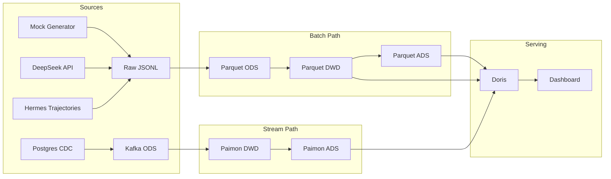

# AI Observability Lakehouse — Upgrade Plan

> Historical note: the upgrade items in this document predate the architecture unification work. The current repository state now uses a shared Paimon DWD/DWS warehouse, Spark backfill/validation instead of a parallel batch warehouse, and Doris as the serving layer.

## Current State

The project implements a stream-batch AI observability lakehouse with:

- **Batch path:** JSONL → Spark backfill/validation → Paimon (DWD → DWS) → Doris
- **Streaming path:** Postgres → Flink CDC → Kafka ODS → Paimon (DWD → DWS)
- **Serving layer:** Doris DUPLICATE KEY tables + dashboard queries
- **Domain model:** LLMRequestEvent, AgentRunEvent, AgentSpanEvent, AgentToolCallEvent
- **Test coverage:** 52 tests, all passing

## Target State

```text
                    Real-time Path
PG ──► Flink CDC ──► Kafka (ODS) ──► Flink SQL ──► Paimon (DWD/DWS)
JSONL ──► Spark Backfill / Validation ────────────────┘
                                                         │
                                                         ▼
                                                     Doris ──► Dashboard
                                                         │
                                                         ▼
                                                   Quarantine Table
```

With: Kafka ODS layer, data quality framework, dimensional modeling, cost anomaly detection, SLA monitoring, CI/CD, ADRs, and performance benchmarks.

---

## Phase 1: Kafka as Real-Time ODS Layer

**Goal:** Add Kafka between Flink CDC and Paimon to decouple capture from transformation.

**Why:** Kafka buffers CDC events during downstream restarts, enables fan-out to multiple consumers, and provides natural replay capability. This matches the standard HSAP architecture pattern.

### 1.1 Add Kafka to Docker Infrastructure

**File:** `docker-compose.yml`

Add Kafka in KRaft mode (no Zookeeper):

```yaml
kafka:
  image: apache/kafka:3.9.0
  container_name: ai-observability-kafka
  ports:
    - "9092:9092"
  environment:
    KAFKA_NODE_ID: 1
    KAFKA_PROCESS_ROLES: broker,controller
    KAFKA_LISTENERS: PLAINTEXT://0.0.0.0:9092,CONTROLLER://0.0.0.0:9093
    KAFKA_ADVERTISED_LISTENERS: PLAINTEXT://kafka:9092
    KAFKA_CONTROLLER_LISTENER_NAMES: CONTROLLER
    KAFKA_CONTROLLER_QUORUM_VOTERS: 1@kafka:9093
    KAFKA_OFFSETS_TOPIC_REPLICATION_FACTOR: 1
    KAFKA_TRANSACTION_STATE_LOG_REPLICATION_FACTOR: 1
    KAFKA_TRANSACTION_STATE_LOG_MIN_ISR: 1
    KAFKA_LOG_RETENTION_HOURS: 48
    CLUSTER_ID: 'ai-observability-kafka-cluster-001'
  volumes:
    - kafka_data:/var/lib/kafka/data
```

Add `kafka_data` to volumes. Add `depends_on: - kafka` to `flink-jobmanager`.

### 1.2 Add Flink Kafka Connector

**File:** `docker/flink/Dockerfile`

```dockerfile
ARG FLINK_KAFKA_VERSION=3.3.0-1.20

RUN wget -q -P /opt/flink/lib \
    "https://repo1.maven.org/maven2/org/apache/flink/flink-sql-connector-kafka/${FLINK_KAFKA_VERSION}/flink-sql-connector-kafka-${FLINK_KAFKA_VERSION}.jar"
```

### 1.3 Replace Paimon ODS with Kafka ODS Table

**Delete:** `flink/sql/02_ods_paimon_tables.sql`

**Create:** `flink/sql/02_ods_kafka_tables.sql`

```sql
CREATE TABLE IF NOT EXISTS kafka_ods_llm_request_events (
    request_id STRING,
    -- ... all source fields ...
    created_at TIMESTAMP(3),
    `date` DATE
) WITH (
    'connector' = 'kafka',
    'topic' = 'ods_llm_request_events',
    'properties.bootstrap.servers' = 'kafka:9092',
    'format' = 'json',
    'json.fail-on-missing-field' = 'false',
    'json.ignore-parse-errors' = 'true',
    'scan.startup.mode' = 'earliest-offset'
);
```

### 1.4 Update Flink SQL Ingestion and Transform

**Rename + modify:** `10_ingest_ods_from_cdc.sql` → `10_ingest_ods_to_kafka.sql`

- Change target: `INSERT INTO kafka_ods_llm_request_events SELECT ... FROM src_llm_request_events`

**Rename + modify:** `20_build_dwd_from_ods.sql` → `20_build_dwd_from_kafka_ods.sql`

- Change source: `FROM kafka_ods_llm_request_events` instead of `FROM paimon_lake.ods.llm_request_events`
- Keep all COALESCE/WHERE validation logic unchanged

**Delete:** `flink/sql/90_verify_ods_count.sql` (Kafka topics are not batch-scannable)

**Unchanged:** `03_dwd_paimon_tables.sql`, `04_dws_paimon_tables.sql`, `30_build_dws_from_dwd.sql`, `91_verify_dwd_count.sql`, `92_verify_dws_metrics.sql`

### 1.5 Optional: Kafka Topic Pre-Creation Script

**Create:** `scripts/create_kafka_topics.sh`

```bash
docker compose exec -T kafka \
  /opt/kafka/bin/kafka-topics.sh --create \
    --topic ods_llm_request_events \
    --partitions 4 \
    --replication-factor 1 \
    --config retention.ms=172800000 \
    --bootstrap-server localhost:9092 \
    --if-not-exists
```

### 1.6 Update Tests

**File:** `tests/test_flink_sql_assets.py`

- Update `EXPECTED_FLINK_SQL_FILES` list
- Replace Paimon ODS assertions with Kafka connector assertions
- Add `test_ods_kafka_table_uses_kafka_connector()`
- Add `test_compose_defines_kafka_service()`
- Add `test_flink_dockerfile_installs_kafka_connector()`
- Delete `test_flink_verify_ods_count_uses_batch_mode()`

### 1.7 Update Documentation

- `docs/stream_batch_platform.md` — update architecture diagram, add Kafka to engine responsibility table
- `docs/technical_document.md` — update Flink path section, update SQL file table
- `README.md` — change Kafka from aspirational to implemented, update Flink startup commands, fix Superset and Iceberg overclaiming

### Verification

```bash
docker compose build flink-jobmanager
docker compose up -d postgres kafka flink-jobmanager flink-taskmanager
scripts/prepare_flink_warehouse.sh
uv run python -m scripts.generate_mock_llm_logs --count 100 --seed 42
scripts/load_llm_jsonl_to_postgres_source.sh data/raw/mock_llm_requests/events.jsonl
scripts/run_flink_sql_sequence.sh \
  flink/sql/00_catalogs.sql \
  flink/sql/01_source_postgres_cdc.sql \
  flink/sql/02_ods_kafka_tables.sql \
  flink/sql/03_dwd_paimon_tables.sql \
  flink/sql/04_dws_paimon_tables.sql \
  flink/sql/10_ingest_ods_to_kafka.sql \
  flink/sql/20_build_dwd_from_kafka_ods.sql \
  flink/sql/30_build_dws_from_dwd.sql
scripts/run_flink_sql_file.sh flink/sql/91_verify_dwd_count.sql
uv run pytest
```

---

## Phase 2: CI/CD and Engineering Foundation

**Goal:** Automate testing, add one-click demo, standardize development workflow.

### 2.1 GitHub Actions CI

**Create:** `.github/workflows/ci.yml`

```yaml
name: CI
on: [push, pull_request]
jobs:
  test:
    runs-on: ubuntu-latest
    steps:
      - uses: actions/checkout@v4
      - uses: astral-sh/setup-uv@v6
      - run: uv sync --dev
      - run: uv run pytest -v
```

### 2.2 One-Click Demo Script

**Create:** `scripts/run_full_demo.sh`

End-to-end script that:

1. Starts Docker services (Postgres, Kafka, Flink, Doris)
2. Prepares Flink warehouse directories
3. Generates mock LLM + Agent data
4. Loads data to Postgres source
5. Runs Flink SQL streaming pipeline
6. Runs Spark batch pipeline
7. Loads ADS to Doris
8. Executes dashboard queries and prints results

### 2.3 Makefile

**Create:** `Makefile`

```makefile
.PHONY: test pipeline flink-up demo clean lint

test:
	uv run pytest -v

lint:
	uv run ruff check .

pipeline:
	uv run python -m scripts.spark_paimon_backfill --count 1000 --seed 42

flink-up:
	docker compose up -d postgres kafka flink-jobmanager flink-taskmanager

demo:
	scripts/run_full_demo.sh

clean:
	rm -rf data/
```

### 2.4 Align Doris Local Access

**File:** `config/doris/init_fe.sh` — register the BE node after FE becomes reachable.

**File:** `docker-compose.yml` — add `doris-fe`, `doris-be`, and `doris-init` services.

**File:** `scripts/load_dws_metrics_to_doris.py` — default to Doris FE on port `9030`.

**Note:** the local Docker demo uses the default `root` account without a password unless you harden Doris further.

### 2.5 Move SPARK_HOME Cleanup Inside Function

**File:** `scripts/spark_utils.py`

```python
def build_spark_session(app_name: str) -> SparkSession:
    os.environ.pop("SPARK_HOME", None)  # moved from module level
    return (
        SparkSession.builder.appName(app_name)
        .master("local[*]")
        .config("spark.sql.session.timeZone", "UTC")
        .getOrCreate()
    )
```

### Verification

```bash
make test
make pipeline
```

---

## Phase 3: Data Quality Framework

**Goal:** Systematic validation with quarantine pattern instead of ad-hoc checks.

### 3.1 Create Data Quality Module

**Create:** `app/data_quality.py`

```python
VALIDATION_RULES = [
    ("request_id IS NOT NULL",              "completeness", "missing_request_id"),
    ("created_at IS NOT NULL",              "completeness", "missing_created_at"),
    ("prompt_tokens >= 0",                  "validity",     "negative_prompt_tokens"),
    ("completion_tokens >= 0",              "validity",     "negative_completion_tokens"),
    ("total_tokens = prompt_tokens + completion_tokens", "consistency", "token_total_mismatch"),
    ("latency_ms > 0",                      "validity",     "non_positive_latency"),
    ("status IN ('success', 'error')",      "validity",     "invalid_status"),
    ("estimated_cost_usd >= 0",             "validity",     "negative_cost"),
    ("mode IN ('mock', 'live', 'replay', 'hermes')", "validity", "invalid_mode"),
]

def validate_llm_events(df: DataFrame) -> DataFrame:
    """Add _dq_status and _dq_errors columns."""
    ...

def split_valid_quarantine(df: DataFrame) -> tuple[DataFrame, DataFrame]:
    """Split into valid and quarantine DataFrames."""
    ...
```

### 3.2 Integrate into DWD Pipeline

**File:** `scripts/spark_transform_llm_events.py`

After `transform_llm_events()`, call `validate_llm_events()`. Write valid events to DWD, write quarantine events to `data/warehouse/quarantine/llm_request/events.parquet`.

Log both counts:

```python
log_info(LOGGER, "dwd_llm_events_validated", valid=valid_count, quarantine=quarantine_count)
```

### 3.3 Remove Redundant `count_invalid_token_totals()`

This function is now superseded by the DQ framework. Remove from `spark_transform_llm_events.py` and `spark_paimon_backfill.py`. Update tests.

### 3.4 Add Tests

**Create:** `tests/test_data_quality.py`

- Test each validation rule individually
- Test valid events pass unchanged
- Test invalid events get correct `_dq_errors`
- Test quarantine split logic

### Verification

```bash
uv run pytest tests/test_data_quality.py
uv run python -m scripts.spark_paimon_backfill --count 100 --seed 42
```

---

## Phase 4: Dimensional Modeling

**Goal:** Add dimension tables to upgrade from pure fact tables to a star schema.

### 4.1 Model Dimension Table

**Create:** `app/dim_model.py`

```python
@dataclass(frozen=True)
class ModelDimension:
    model_name: str
    provider: str
    input_price_per_1m_tokens: float
    output_price_per_1m_tokens: float
    max_context_tokens: int
    release_date: str
    status: str  # active / deprecated
```

**Create:** `scripts/spark_build_dim_model.py`

Build a `dim_model` Parquet table from `app/dim_model.py` definitions.

**Add to:** `sql/create_doris_tables.sql`

```sql
CREATE TABLE IF NOT EXISTS ai_observability.dim_model (
    model_name String,
    provider String,
    input_price_per_1m_tokens Float64,
    output_price_per_1m_tokens Float64,
    max_context_tokens UInt32,
    release_date Date,
    status String
) UNIQUE KEY(model_name)
DISTRIBUTED BY HASH(model_name) BUCKETS 1
PROPERTIES (
    "replication_num" = "1",
    "enable_unique_key_merge_on_write" = "true"
);
```

### 4.2 Agent Dimension Table (Optional)

**Create:** `scripts/spark_build_dim_agent.py`

Extract unique agents from DWD `agent_run_events` and build a `dim_agent` table with agent_id, agent_name, latest version, first_seen, last_seen.

### 4.3 Update Dashboard Queries

**File:** `sql/doris_dashboard_queries.sql`

Add a query that joins `dws_llm_feature_daily_metrics` with `dim_model` to show cost per model with pricing metadata:

```sql
SELECT
    m.model_name,
    m.provider,
    m.input_price_per_1m_tokens,
    a.request_count,
    a.total_tokens,
    a.estimated_cost_usd
FROM (
    SELECT model_name, sum(request_count) AS request_count, sum(total_tokens) AS total_tokens, sum(estimated_cost_usd) AS estimated_cost_usd
    FROM ai_observability.dws_llm_feature_daily_metrics
    GROUP BY model_name
) a
JOIN ai_observability.dim_model m ON a.model_name = m.model_name
ORDER BY estimated_cost_usd DESC;
```

### Verification

```bash
uv run pytest
uv run python -m scripts.spark_build_dim_model
```

---

## Phase 5: Business Analytics Layer

**Goal:** Add cost anomaly detection, SLA monitoring, and prompt version analytics.

### 5.1 Cost Anomaly Detection

**Create:** `scripts/spark_build_ads_cost_anomaly.py`

Using a window function over `dws_llm_feature_daily_metrics`:

```python
window = Window.partitionBy("app_name", "feature_name", "model_name").orderBy("date")

metrics.withColumn("prev_day_cost", F.lag("estimated_cost_usd").over(window)) \
       .withColumn("cost_change_rate",
           F.when(F.col("prev_day_cost") > 0,
               (F.col("estimated_cost_usd") - F.col("prev_day_cost")) / F.col("prev_day_cost")
           ).otherwise(F.lit(None))
       ) \
       .withColumn("is_anomaly",
           F.col("cost_change_rate") > 2.0  # >200% increase
       )
```

Output: `data/warehouse/ads/cost_anomaly_daily.parquet`

Add Doris table for anomaly alerts.

### 5.2 SLA Monitoring

**Create:** `config/sla_rules.yaml`

```yaml
rules:
  - feature_name: chat
    p95_latency_ms_max: 3000
    error_rate_max: 0.05
  - feature_name: rag_answer
    p95_latency_ms_max: 5000
    error_rate_max: 0.03
```

**Create:** `scripts/spark_build_ads_sla_daily.py`

Join ADS metrics with SLA rules. Output: `sla_daily_report` with `is_latency_breach`, `is_error_breach` columns.

### 5.3 Prompt Version Impact Analysis

**Create:** `scripts/spark_build_ads_prompt_version_metrics.py`

Grain: `date + prompt_id + prompt_version + model_name`

Metrics: request_count, avg_latency_ms, p95_latency_ms, error_count, estimated_cost_usd

This lets you compare v1 vs v2 of the same prompt on the same model.

### Verification

```bash
uv run pytest
uv run python -m scripts.spark_paimon_backfill --count 1000 --seed 42
uv run python -m scripts.spark_build_ads_cost_anomaly
```

---

## Phase 6: Production Hardening

**Goal:** Incremental processing, schema evolution, Doris optimization.

### 6.1 Incremental Partition Processing

**File:** `scripts/spark_transform_llm_events.py`

Add `--start-date` and `--end-date` arguments. Filter ODS input by date range. Use `mode("overwrite")` only on affected partitions via `partitionOverwriteMode = dynamic`:

```python
spark.conf.set("spark.sql.sources.partitionOverwriteMode", "dynamic")
events.write.mode("overwrite").partitionBy("date").parquet(str(output_path))
```

This overwrites only the date partitions present in the current batch, not the entire table.

### 6.2 Doris Materialized Views

**Add to:** `sql/create_doris_tables.sql`

```sql
CREATE MATERIALIZED VIEW IF NOT EXISTS ai_observability.mv_daily_summary
BUILD IMMEDIATE
REFRESH AUTO ON MANUAL
DISTRIBUTED BY HASH(`date`) BUCKETS 1
AS
SELECT
    `date`,
    SUM(request_count) AS request_count,
    SUM(success_count) AS success_count,
    SUM(error_count) AS error_count,
    SUM(total_tokens) AS total_tokens,
    SUM(estimated_cost_usd) AS estimated_cost_usd
FROM ai_observability.dws_llm_feature_daily_metrics
GROUP BY `date`;
```

### 6.3 Pipeline Run Metadata Table

**Create:** `app/pipeline_metadata.py`

After each Spark script runs, log a row to `data/warehouse/pipeline_runs.jsonl`:

```json
{
  "pipeline_name": "spark_transform_llm_events",
  "layer": "dwd",
  "start_time": "2026-01-01T00:00:00Z",
  "end_time": "2026-01-01T00:00:12Z",
  "duration_ms": 12000,
  "input_rows": 1000,
  "output_rows": 985,
  "quarantine_rows": 15,
  "status": "success"
}
```

### 6.4 Fix Agent ADS Join Fan-Out

**File:** `scripts/spark_build_dws_agent_daily_metrics.py`

The span_metrics join key `["date", "agent_id"]` is narrower than the run_metrics key `["date", "app_name", "agent_id", "agent_name", "task_type"]`. This duplicates span counts across task types.

Fix: add a comment documenting this as a known limitation, or restructure so span metrics are a separate ADS output (the `agent_tool_daily_metrics` table already handles tool-level metrics separately).

### 6.5 Remove `span_failure_rate` from Agent ADS

For consistency with the LLM ADS design (rates derived at query time, not stored), remove `span_failure_rate` from:

- `scripts/spark_build_dws_agent_daily_metrics.py`
- `sql/create_doris_tables.sql`

Derive at query time: `failed_span_count / span_count AS span_failure_rate`.

### Verification

```bash
uv run pytest
uv run python -m scripts.spark_paimon_backfill --count 10000 --seed 42
```

---

## Phase 7: Interview Differentiation

**Goal:** ADRs, benchmarks, and chaos testing for maximum portfolio impact.

### 7.1 Architecture Decision Records

**Create:** `docs/adr/`

| File | Title |
|---|---|
| `001-paimon-over-iceberg.md` | Why Paimon instead of Iceberg for lakehouse storage |
| `002-kafka-as-realtime-ods.md` | Why Kafka as real-time ODS instead of direct CDC to Paimon |
| `003-no-stored-rates-in-ads.md` | Why ADS stores counts, not pre-computed rates |
| `004-flink-ads-p95-max-proxy.md` | Why Flink ADS uses MAX as p95 proxy |
| `005-generic-agent-model.md` | Why generic agent spans instead of Dify-specific workflow nodes |

Each ADR follows the standard format: Context, Decision, Consequences.

### 7.2 Performance Benchmark

**Create:** `scripts/run_benchmark.py`

Run the pipeline at 10K, 100K, 1M events. Record:

- Spark job duration (ODS, DWD, ADS separately)
- Parquet file size
- Doris query latency (p50, p95 for each dashboard query)

Output: `docs/benchmark_results.md`

| Scale | ODS Duration | DWD Duration | ADS Duration | Parquet Size | Doris Query P95 |
|---|---|---|---|---|---|
| 10K | | | | | |
| 100K | | | | | |
| 1M | | | | | |

### 7.3 Chaos / Failover Test

**Create:** `scripts/test_flink_failover.sh`

1. Start full streaming pipeline (Postgres → Kafka → Paimon DWD)
2. Insert 100 rows into Postgres
3. Wait for Paimon DWD to catch up
4. `docker stop ai-observability-flink-taskmanager`
5. Insert 50 more rows into Postgres (buffered in Kafka)
6. `docker start ai-observability-flink-taskmanager`
7. Wait for recovery
8. Verify Paimon DWD has 150 rows (zero loss)

**Create:** `docs/failover_test_report.md` — document the procedure and results.

### 7.4 Data Lineage Diagram

**Create:** `docs/data_lineage.md`



### Verification

```bash
uv run pytest
scripts/run_benchmark.py
```

---

## Files Summary

| Phase | New Files | Modified Files | Deleted Files |
|---|---|---|---|
| 1 | `flink/sql/02_ods_kafka_tables.sql`, `scripts/create_kafka_topics.sh` | `docker-compose.yml`, `docker/flink/Dockerfile`, `flink/sql/10_*.sql`, `flink/sql/20_*.sql`, `tests/test_flink_sql_assets.py`, `README.md`, `docs/stream_batch_platform.md`, `docs/technical_document.md` | `flink/sql/02_ods_paimon_tables.sql`, `flink/sql/90_verify_ods_count.sql` |
| 2 | `.github/workflows/ci.yml`, `Makefile`, `scripts/run_full_demo.sh` | `scripts/spark_utils.py`, `config/doris/init_fe.sh`, `docker-compose.yml`, `scripts/load_dws_metrics_to_doris.py` | |
| 3 | `app/data_quality.py`, `tests/test_data_quality.py` | `scripts/spark_transform_llm_events.py`, `scripts/spark_paimon_backfill.py` | |
| 4 | `app/dim_model.py`, `scripts/spark_build_dim_model.py` | `sql/create_doris_tables.sql`, `sql/doris_dashboard_queries.sql` | |
| 5 | `scripts/spark_build_ads_cost_anomaly.py`, `scripts/spark_build_ads_sla_daily.py`, `scripts/spark_build_ads_prompt_version_metrics.py`, `config/sla_rules.yaml` | `sql/create_doris_tables.sql` | |
| 6 | `app/pipeline_metadata.py` | `scripts/spark_transform_llm_events.py`, `scripts/spark_build_dws_agent_daily_metrics.py`, `sql/create_doris_tables.sql` | |
| 7 | `docs/adr/*.md`, `scripts/run_benchmark.py`, `scripts/test_flink_failover.sh`, `docs/benchmark_results.md`, `docs/failover_test_report.md`, `docs/data_lineage.md` | | |

---

## Priority and Dependency Order

```text
Phase 1 (Kafka)
  │
  ├──► Phase 2 (CI/CD + Engineering Foundation)  ← do immediately, independent
  │
  ├──► Phase 3 (Data Quality)  ← depends on Phase 1 for Flink DQ extension
  │       │
  │       ▼
  │    Phase 4 (Dimensional Modeling)  ← builds on clean DWD from Phase 3
  │       │
  │       ▼
  │    Phase 5 (Business Analytics)  ← needs ADS tables from Phase 4
  │
  ├──► Phase 6 (Production Hardening)  ← can start after Phase 1
  │
  └──► Phase 7 (Interview Differentiation)  ← can start after Phase 1
```

Phase 2 and Phase 7.1 (ADRs) have the highest ROI per hour invested.
